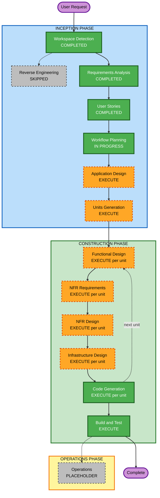

# Execution Plan — HeartRateCoach

## Detailed Analysis Summary

### Change Impact Assessment

| Area | Impact | Description |
|---|---|---|
| User-facing changes | Yes | Entire new product — 6 iPhone screens + 3 Watch screens |
| Structural changes | Yes | Multi-target Xcode project with local SPM package |
| Data model changes | Yes | New Firestore schema: users, sessions, hr_stream |
| API changes | Yes | New HealthKit + WatchConnectivity integration |
| NFR impact | Yes | < 2 sec coaching latency, HealthKit privacy, Firebase Auth security, PBT for zone math |

### Risk Assessment

| Dimension | Level | Notes |
|---|---|---|
| **Overall Risk** | High | Multi-platform native development with real-time sensor data |
| **Rollback Complexity** | Moderate | Greenfield — no existing code to break, but HealthKit/Watch entitlements can be tricky |
| **Testing Complexity** | Complex | HealthKit and WatchConnectivity require physical devices; simulator coverage is partial |
| **Security Risk** | High | Health data + Firebase Auth + Keychain — Security extension fully enforced |

---

## Workflow Visualization



### Text Alternative

```
INCEPTION PHASE
  Workspace Detection      COMPLETED
  Reverse Engineering      SKIPPED (greenfield)
  Requirements Analysis    COMPLETED
  User Stories             COMPLETED
  Workflow Planning        IN PROGRESS
  Application Design       EXECUTE
  Units Generation         EXECUTE

CONSTRUCTION PHASE (per unit x4)
  Functional Design        EXECUTE
  NFR Requirements         EXECUTE
  NFR Design               EXECUTE
  Infrastructure Design    EXECUTE
  Code Generation          EXECUTE

  Build and Test           EXECUTE

OPERATIONS PHASE
  Operations               PLACEHOLDER
```

---

## Phases to Execute

### INCEPTION PHASE

- [x] Workspace Detection — COMPLETED
- [x] Reverse Engineering — SKIPPED (greenfield, no existing code)
- [x] Requirements Analysis — COMPLETED
- [x] User Stories — COMPLETED
- [ ] Workflow Planning — IN PROGRESS (this document)
- [ ] Application Design — **EXECUTE**
  - **Rationale**: New multi-platform system requires component identification: SPM package structure, CoachingEngine service design, WatchBridge interface, FirebaseService, HealthKitService, and the 3-layer coaching architecture all need explicit design before code generation
- [ ] Units Generation — **EXECUTE**
  - **Rationale**: System decomposes naturally into 4 independent units that must be built in sequence due to dependency ordering (Core → iPhone Foundation → iPhone Workout Engine → Watch App)

### CONSTRUCTION PHASE (per unit)

- [ ] Functional Design — **EXECUTE** (all 4 units)
  - **Rationale**: New data models (UserProfile, HRZones, WorkoutProgram, Session), complex business logic (Karvonen formula, 3-layer coaching engine, workout phase sequences), and PBT property identification (PBT-01) all require explicit functional design
- [ ] NFR Requirements — **EXECUTE** (all 4 units)
  - **Rationale**: Performance (< 2 sec latency), security (HealthKit privacy, Keychain, Firebase Auth tokens), and PBT framework selection (PBT-09) must be documented per unit
- [ ] NFR Design — **EXECUTE** (all 4 units)
  - **Rationale**: Security patterns (SECURITY-01, SECURITY-08, SECURITY-12) and performance patterns (async Firebase writes, HR smoothing) must be designed before code generation
- [ ] Infrastructure Design — **EXECUTE** (Units 2–4; Unit 1 has no infrastructure dependencies)
  - **Rationale**: Firebase project setup, HealthKit entitlements, WatchConnectivity session management, and Core Data offline queue require explicit infrastructure mapping
- [ ] Code Generation — **EXECUTE** (all 4 units, ALWAYS)
- [ ] Build and Test — **EXECUTE** (ALWAYS)

### OPERATIONS PHASE
- [ ] Operations — PLACEHOLDER

---

## Proposed Unit Breakdown (Preview — Units Generation will finalise)

| Unit | Name | Contents | Dependencies |
|---|---|---|---|
| 1 | HeartRateCoachCore (SPM) | UserProfile, HRZones, WorkoutProgram, Session models; ZoneCalculator; workout phase definitions; shared constants | None |
| 2 | iPhone Foundation | Auth (Sign in with Apple), Onboarding, Settings, HR Zone display, FirebaseService (profile + zones), HealthKitService | Unit 1 |
| 3 | iPhone Workout Engine | CoachingEngine (3 layers), SafetyMonitor, WatchBridge, Workout Active UI, Session Summary, History, offline queue | Units 1 + 2 |
| 4 | Apple Watch App | WatchSessionManager, HKWorkoutSession, HapticManager, Watch views (Workout Active, Coaching Overlay, Emergency Stop) | Unit 1 |

**Build sequence**: Unit 1 → Unit 2 → Unit 4 (parallel with Unit 3 possible) → Unit 3

---

## Success Criteria

- **Primary Goal**: Fully functional iPhone + Apple Watch HR coaching app
- **Key Deliverables**: Xcode project with 3 targets + SPM package, Firebase project, 20 user stories verified
- **Quality Gates**:
  - All 20 user stories pass acceptance criteria on physical device
  - ZoneCalculator and CoachingEngine have passing PBT suites (PBT-02, PBT-03, PBT-07–09)
  - Security rules SECURITY-01, SECURITY-08, SECURITY-12 verified compliant
  - Coaching latency < 2 seconds measured on device
  - Session saves correctly online and offline
